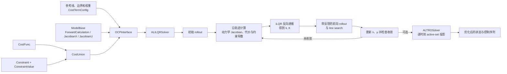

# AL-iLQR / ALTRO 轨迹优化实验实现

这是一个使用 C++17 和 Eigen 编写的实验性轨迹优化项目，实现了以下两个逐步演进的求解流程：

- **AL-iLQR**：在 iLQR 上加入增广拉格朗日（Augmented Lagrangian, AL）机制，以处理一般的状态与控制约束；
- **ALTRO 风格的 solution polishing**：先以 AL-iLQR 获得动力学可行的解，再对激活约束做目标函数加权的投影修正，以进一步降低约束违反量。

项目最初配套于知乎文章[《一种 AL-iLQR 的框架实现和应用》](https://zhuanlan.zhihu.com/p/703259867)。仓库保留了开发过程中的两个代码快照：当前的 `altro_fix/` 是推荐阅读和运行的版本；`alilqr/` 是较早期的实现，主要用于回溯架构演进。

> [!WARNING]
> 这是研究与原型代码，而不是已经产品化的通用求解器。示例的参考线、约束参数和权重直接写在源文件中；没有命令行接口、数据加载格式或持续集成测试。使用前请先阅读“限制与已知边界”。

## 能做什么

`altro_fix/` 中有两个车辆轨迹优化示例：

| 目标 | 入口 | 状态与控制 | 离散变量 |
| --- | --- | --- | --- |
| 曲率平滑与道路边界约束 | `main.cpp` | $x=[p_x,p_y,\theta,\kappa,\dot\kappa]$ <br> $u=[\ddot\kappa]$ | 弧长 $ds$ |
| 横纵向耦合的轨迹优化 | `motion_planning/motion_planning.cpp` | $x=[p_x,p_y,\theta,\kappa,v,a]$ <br> $u=[j,\dot\kappa]$ | 时间 $dt$ |

后一个模型覆盖了 jerk、曲率变化率、速度、加速度、向心加速度/jerk、航向误差以及道路安全距离等常见车辆规划项。位置积分使用 10 点 Gauss–Legendre 积分，以减小简单欧拉积分对曲线段的累计误差。

## 目录与架构

```text
.
├── altro_fix/                         # 当前推荐使用的实现
│   ├── main.cpp                       # 5 状态、1 控制的曲率平滑示例
│   ├── motion_planning/               # 6 状态、2 控制的耦合规划示例
│   ├── augmented_ilqr/                # AL-iLQR 与 polishing 求解器
│   ├── model/                         # 动力学抽象与 SmoothKappaModel
│   ├── cost_function/                 # 代价接口、参数及具体代价项
│   ├── constrain_definition/          # 约束抽象、乘子/罚因子状态与罚函数
│   ├── basic_constraint/              # 曲率、航向、控制和边界安全约束
│   ├── frenet_coordinate/             # 样条、Frenet/Cartesian 坐标变换
│   ├── calculus.h                     # Gauss–Legendre 数值积分
│   ├── test_constraint.cpp            # 约束构造的手工实验程序
│   └── CMakeLists.txt
└── alilqr/                            # 早期 AL-iLQR / ALTRO 实现快照
```



核心职责如下：

- `ModelBase` 定义离散动力学 $f(x_k,u_k)$ 及其对状态、控制的 Jacobian；
- `CostFunc` 定义运行代价或终端代价，以及一阶、二阶导数；
- `Constraint` 描述单个约束，`ConstraintValue` 保存每个离散节点对应的约束值、拉格朗日乘子 $\lambda$ 和罚因子 $\mu$；
- `CostUnion` 汇总代价与约束的值、梯度、Hessian，并向求解器暴露终端 cost-to-go；
- `ALILQRSolver` 完成 rollout、线性化、Ricatti 反向递推、正则化与线搜索；
- `ALTROSolver` 在 AL-iLQR 解的基础上执行 active-set projection。

## 优化问题与算法原理

### 离散最优控制问题

对于长度为 $N$ 的轨迹，求解器优化控制序列 $u_{0:N-1}$，状态由动力学前向展开：

$$
\begin{aligned}
\min_{x_{0:N},u_{0:N-1}}\quad
& \ell_N(x_N) + \sum_{k=0}^{N-1}\ell_k(x_k,u_k) \\
\text{s.t.}\quad
& x_{k+1}=f_k(x_k,u_k),\\
& h_k(x_k,u_k)=0,\\
& g_k(x_k,u_k)\le0.
\end{aligned}
$$

代码采用 single-shooting 形式：给定初始状态与控制初值后，每次前向 rollout 都通过 `ModelBase::ForwardCalculation` 重新生成整条状态轨迹，因此动力学约束始终由前向积分强制满足。

### iLQR：线性化、二次近似和反向递推

iLQR 在当前标称轨迹 $(\bar{x}_k,\bar{u}_k)$ 附近保留动力学的一阶项：

$$
\delta x_{k+1}\approx f_{x,k}\delta x_k+f_{u,k}\delta u_k,
$$

并对代价做二次近似。与完整 DDP 不同，该实现不使用动力学的二阶导数。反向过程构造局部 $Q$ 函数，例如：

$$
\begin{aligned}
Q_u &= \ell_u+f_u^T V_x',\\
Q_{uu} &= \ell_{uu}+f_u^T V_{xx}'f_u,\\
Q_{ux} &= \ell_{ux}+f_u^T V_{xx}'f_x.
\end{aligned}
$$

求得前馈与反馈增益：

$$
k=-Q_{uu}^{-1}Q_u,\qquad K=-Q_{uu}^{-1}Q_{ux}.
$$

在前向阶段，控制更新为：

$$
u_k^{\mathrm{new}}=u_k+\alpha k_k+K_k(x_k^{\mathrm{new}}-\bar{x}_k).
$$

其中 $\alpha$ 通过 line search 从 1 开始逐步折半；实际下降量与预测下降量之比满足阈值时接受该步。为缓解 $Q_{uu}$ 非正定或病态问题，代码以 $Q_{uu}+\rho I$ 进行 Levenberg–Marquardt 风格正则化，并依据 line search 成败调整 $\rho$。

### 增广拉格朗日：处理约束

对某个约束残差 $c(x,u)$，增广拉格朗日项采用：

$$
\mathcal{L}_A=\ell(x,u)+\lambda c(x,u)+\frac{1}{2}\mu c(x,u)^2.
$$

因此在一阶近似中，约束会加入：

$$
\nabla c^T(\lambda+\mu c),
$$

在 Gauss–Newton 二阶近似中，加入：

$$
\mu\nabla c^T\nabla c.
$$

`ConstraintValue` 为每个节点单独保存 $\lambda_k$ 与 $\mu_k$。乘子更新遵循：

$$
\lambda^+ =
\begin{cases}
\lambda+\mu c, & c\in\mathcal{E},\\
\max(0,\lambda+\mu c), & c\in\mathcal{I},
\end{cases}
$$

其中 $\mathcal{E}$ 与 $\mathcal{I}$ 分别表示等式与不等式约束。实现中的 `OneSideCost` / `OneSideQuadraticCost` 负责将单侧约束转换为适合惩罚的残差形式。

### ALTRO 风格的 solution polishing

`ALTROSolver` 先运行 AL-iLQR，再基于当前时刻的活动约束计算约束 Jacobian $D$ 和代价 Hessian $H$，并对状态-控制增量进行目标函数加权投影。它的目的不是继续大幅降低代价，而是在保持局部最优解质量的同时降低最终违反量。

对第 $t$ 个节点，令状态与控制拼接为 $z_t=[x_t^T,u_t^T]^T$。代码会从当前活动集构造约束 Jacobian $D_t$，并将活动约束的残差收集为 $r_t$；同时只使用**原始代价项**的 Hessian 组成 $H_t$。局部投影问题写成：

$$
\begin{aligned}
\min_{\delta z_t}\quad & \frac{1}{2}\delta z_t^T H_t\delta z_t\\
\text{s.t.}\quad & D_t\delta z_t=r_t.
\end{aligned}
$$

当 $H_t$ 与 $D_tH_t^{-1}D_t^T$ 可逆时，代码中的更新为：

$$
\delta z_t=H_t^{-1}D_t^T
\left(D_tH_t^{-1}D_t^T\right)^{-1}r_t,
\qquad
z_t^+=z_t+\alpha\delta z_t.
$$

其中 $\alpha$ 从 1 开始折半；只有活动约束残差的无穷范数下降时才接受更新。对 Cholesky 分解失败的矩阵，`ALTROSolver` 会退回到 SVD 伪逆。这里 $r_t$ 的符号遵循每个具体约束在代码中的定义，扩展新约束时不应机械替换为 $-c_t$。

需要特别注意：此仓库的 polishing 是**逐时刻**构造并求解局部投影，而不是论文中将整个 horizon 联合成一个大 KKT 系统的实现。因此它应视为一个实用的近似投影版本，而不能与原论文的完整算法逐项等同。

## 关键实现对应关系

### 5 状态曲率模型

`model/smooth_kappa_model.h` 实现 `SmoothKappaModel`。以弧长 $ds$ 为步长，状态和控制为：

$$
x=[p_x,p_y,\theta,\kappa,\dot\kappa],\qquad u=[\ddot\kappa].
$$

其离散更新为：

$$
\begin{aligned}
p_x^+ &= p_x+\cos\theta\,ds,\\
p_y^+ &= p_y+\sin\theta\,ds,\\
\theta^+ &= \theta+\kappa ds+\tfrac12\dot\kappa ds^2+\tfrac16\ddot\kappa ds^3,\\
\kappa^+ &= \kappa+\dot\kappa ds+\tfrac12\ddot\kappa ds^2,\\
\dot\kappa^+ &= \dot\kappa+\ddot\kappa ds.
\end{aligned}
$$

`main.cpp` 使用该模型，将参考线转到 Frenet 坐标，构造道路边界及安全距离，并注册以下代价与约束：

- 代价：横向偏移、曲率、横向舒适性；
- 约束：道路边界安全距离、控制量、航向跟踪、曲率上/下界。

### 6 状态横纵向耦合模型

`motion_planning/mix_model.h` 的 `MixModel` 使用：

$$
x=[p_x,p_y,\theta,\kappa,v,a],\qquad u=[j,\dot\kappa].
$$

位置变化由速度和航向的积分给出；实现使用 `calculus.h` 中的 10 点 Gauss–Legendre 公式计算 $\Delta p_x$ 和 $\Delta p_y$。`motion_planning/motion_planning.cpp` 在此基础上注册向心加速度、向心 jerk、曲率变化率、纵向 jerk、参考线偏移和目标速度等代价，并加入相应的动力学和道路安全约束。

## 构建与运行

### 依赖

`altro_fix/CMakeLists.txt` 明确要求：

- CMake 3.24 或更高版本；
- 支持 C++17 的编译器；
- Eigen3，且 CMake 能找到 `Eigen3Config.cmake`；
- Python3 Interpreter 和 Development 组件；
- NumPy（CMake 中为可选查找，但建议安装）；
- Python Matplotlib（运行会调用 `matplotlibcpp` 绘图）。

若 Eigen 安装在非标准路径，可在配置时额外传入 `-DEigen3_DIR=/path/to/Eigen3Config.cmake`，或设置合适的 `CMAKE_PREFIX_PATH`。

### 命令

从仓库根目录运行：

```bash
cmake -S altro_fix -B build/altro_fix -DCMAKE_BUILD_TYPE=Release
cmake --build build/altro_fix --parallel

# 5 状态、1 控制的曲率平滑示例
./build/altro_fix/alilqr

# 6 状态、2 控制的横纵向耦合示例
./build/altro_fix/mp

# 约束/积分相关的手工实验程序
./build/altro_fix/test
```

构建文件定义了三个可执行目标：`alilqr`、`mp` 和 `test`。前两个示例会使用 `matplotlibcpp` 显示图形；运行环境需要能导入 Matplotlib 并具备可用的图形后端。

> 当前仓库的构建预检在一台 macOS 环境中停在 Eigen3 查找阶段（系统未安装或未暴露 `Eigen3Config.cmake`）。因此上述命令反映 CMake 的预期用法，但尚未在该环境完成端到端编译验证。

## 如何扩展

新增模型、代价或约束时，建议沿用现有接口，不要直接修改求解器主循环：

1. 继承 `ModelBase<T, M, N>`，实现 `ForwardCalculation`、`JacobianX`、`JacobianU`；
2. 继承 `CostFunc<T, M, N>`，实现 `Evaluate`、`Gradient`、`Hessian`，并从 `CostTermConfig` 读取参数；
3. 继承 `Constraint<T, M, N, Equality>` 或 `Constraint<T, M, N, Inequality>`，实现约束值、梯度和 Hessian 接口；
4. 在入口文件创建 `OCPInterface`，依次设置 `CostTermConfig`、`CostUnion`、代价项、约束项和模型；
5. 以正确长度初始化 `Controls`，再调用 `ALILQRSolver::Solve`；需要投影阶段时使用 `ALTROSolver::Solve`。

仓库目前显式实例化了 `double` 下的部分维度组合（包括 `5×1`、`4×2`、`6×2`）。如需引入新的状态/控制维度，应同时检查各模板实现文件中是否需要补充显式实例化。

## 限制与已知边界

- 示例数据和参数写死在 `.cpp` 中，结果不应被当作通用性能基准；
- `test` 是手工验证可执行程序，而不是 Catch2、GoogleTest 等框架下的自动化测试套件；
- 求解器仍是局部优化方法，初值、权重、罚因子、离散步长和参考线光滑度都会显著影响收敛质量；
- 增广拉格朗日的二阶项使用 Gauss–Newton 近似，忽略约束的二阶导数；并且当前 `CostUnion::CalcAugLagConstraintHessian` 只累计了等式约束的该近似项。将其用于新的不等式约束问题前，应先针对目标问题验证收敛性；
- ALTRO polishing 采用逐时刻局部投影，不是完整 horizon KKT 投影；
- 仓库中未包含 `LICENSE` 文件。复用、发布或商用前应先由维护者明确许可条款。

## 参考文献与延伸阅读

1. Brian E. Jackson. [*AL-iLQR Tutorial*](https://bjack205.github.io/papers/AL_iLQR_Tutorial.pdf), 2019. 本仓库增广拉格朗日 iLQR 推导与实现的主要参考。
2. Brian E. Jackson and Taylor A. Howell. [*iLQR Tutorial*](https://rexlab.ri.cmu.edu/papers/iLQR_Tutorial.pdf), 2019. LQR/iLQR 的基础推导与实现背景。
3. Taylor A. Howell, Brian E. Jackson, and Zachary Manchester. [*ALTRO: A Fast Solver for Constrained Trajectory Optimization*](https://publications.ri.cmu.edu/altro-a-fast-solver-for-constrained-trajectory-optimization), IROS 2019, pp. 7674–7679. AL-iLQR 与 solution polishing 的原始 ALTRO 论文。
4. Brian E. Jackson, Tarun Punnoose, Daniel Neamati, Kevin Tracy, Rianna Jitosho, and Zachary Manchester. [*ALTRO-C: A Fast Solver for Conic Model-Predictive Control*](https://publications.ri.cmu.edu/altro-c-a-fast-solver-for-conic-model-predictive-control), ICRA 2021. 关于 ALTRO 思路在凸锥 MPC 中的扩展。
5. Yuval Tassa, Tom Erez, and Emanuel Todorov. [*Synthesis and Stabilization of Complex Behaviors through Online Trajectory Optimization*](https://doi.org/10.1109/IROS.2012.6386025), IROS 2012. iLQR/DDP 在线轨迹优化的重要参考。
6. Yajia Zhang, Hongyi Sun, Ruizhi Chai, Daike Kang, Shan Li, and Liyun Li. [*Optimal Vehicle Trajectory Planning for Static Obstacle Avoidance using Nonlinear Optimization*](https://arxiv.org/abs/2307.09466), arXiv:2307.09466, 2023. 与 `motion_planning/` 中车辆状态、舒适性和道路约束建模相关的背景材料。
7. LTsommer. [*一种 AL-iLQR 的框架实现和应用*](https://zhuanlan.zhihu.com/p/703259867), 2024. 本项目的原始开发记录与实验说明。
